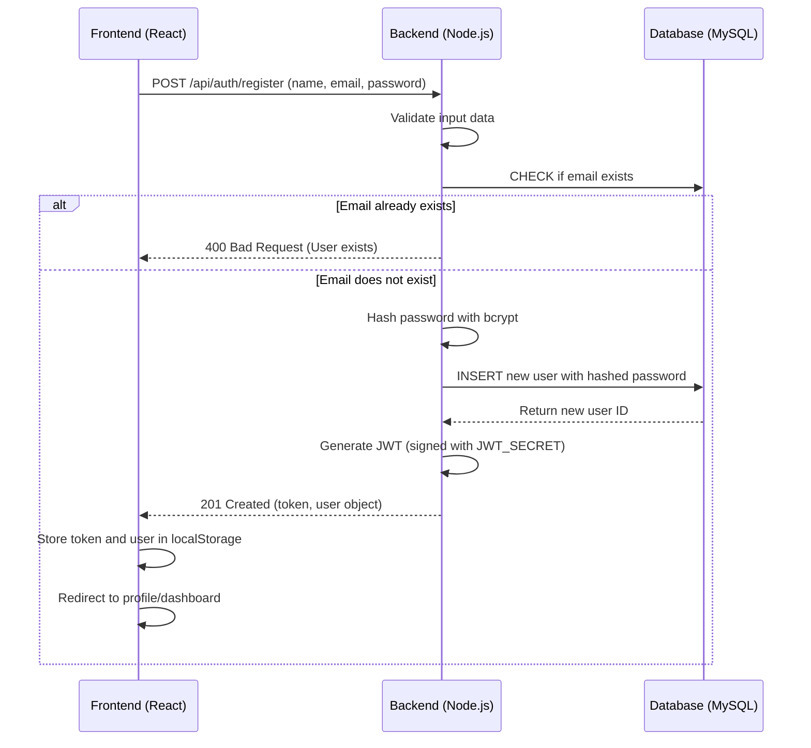
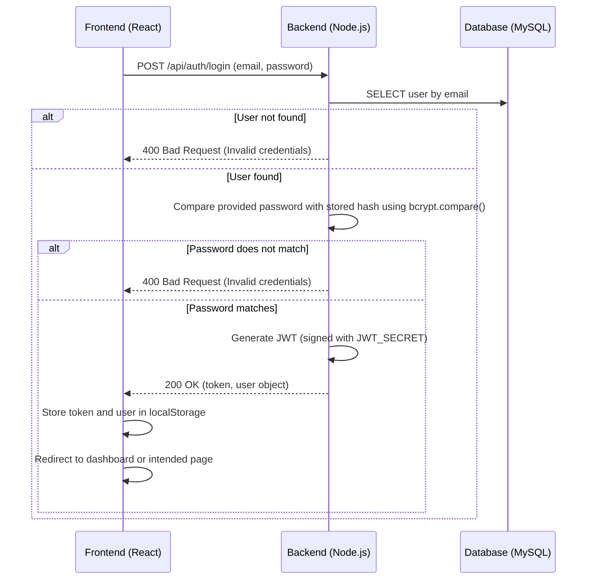
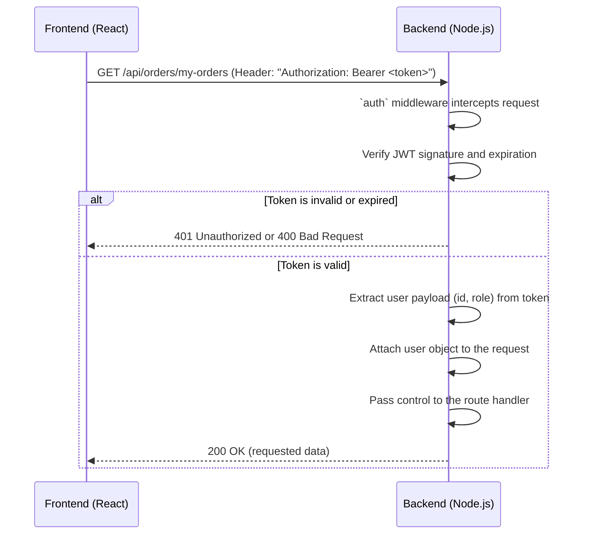
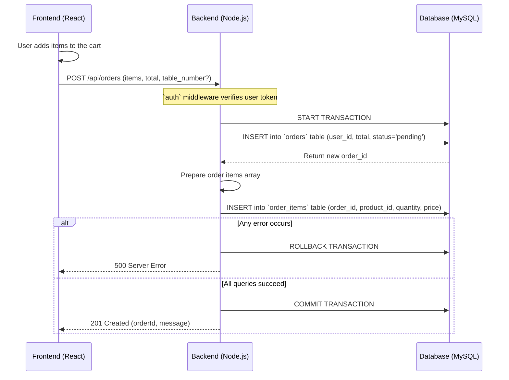
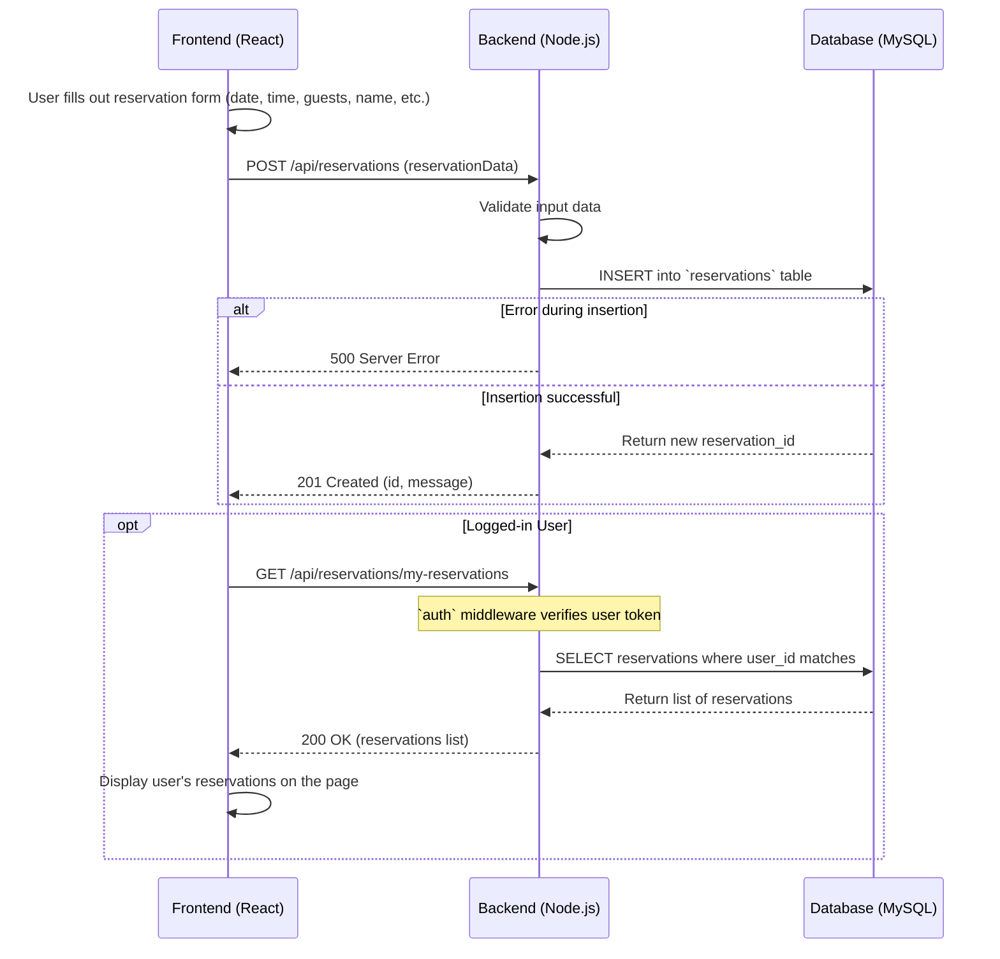

# Delicias Restaurant - System Documentation

This document outlines the key process flows and architecture of the Delicias Restaurant digital platform.

## 1. Authentication Flow

The authentication system uses JSON Web Tokens (JWT) for secure, stateless authentication.

### 1.1. User Registration

A new user provides their name, email, and password to register. The backend hashes the password using `bcrypt` before storing it, ensuring that plaintext passwords are never saved.

### 1.2. User Login

A registered user logs in with their email and password. The backend compares the provided password with the stored hash.

### 1.3. Authenticated API Requests

Once logged in, the JWT is sent in the `Authorization` header for all protected API requests. A `axios` interceptor on the frontend automates this process. The backend uses middleware to verify the token.

## 2. Order Placement Flow

This flow describes how a logged-in user places an order. The backend uses a database transaction to ensure that the order and its associated items are created atomically.

## 3. Reservation Flow

A user (either a guest or logged-in) can make a reservation. If logged in, their details are pre-filled.

